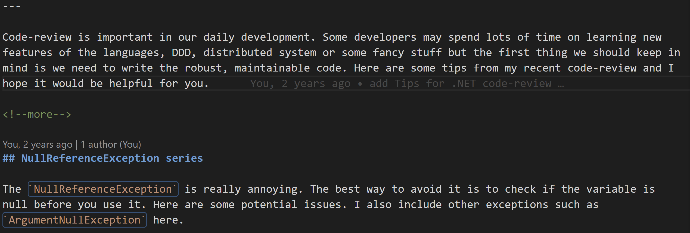

# ReVision

**ReVision** is a VSCode extension that allows you to quickly and easily revise your written work. It uses [OpenAI](https://openai.com/) to generate new text based on your existing text. It can use different writing styles to improve your writing, and can also be used to translate your text into a different language.

## Features

ReVision can use OpenAI or Azure OpenAI:

* [OpenAI API](https://openai.com/blog/openai-api/). You can sign up for a free account [here](https://beta.openai.com/). Once you have an account, you can generate an API key [here](https://beta.openai.com/account/api-keys). You can then paste your API key into the extension settings.
* [Azure OpenAI API](https://learn.microsoft.com/en-us/azure/cognitive-services/openai/). Azure OpenAI is a paid service provided by Microsoft. If you have got the API key, you can paste it into the extension settings. Besides the API key, you also need to specify the endpoint URL and the deployment name. Currently, ReVision supports `text-davinci-003`. The other models may not be able to get expected outputs. If you want to use other models, please open an issue.

Revise the text using ReVision:

Translate the text using ReVision:

### Revising

ReVision supports multiple writing styles. You can choose from the following styles:

* professional
* formal
* casual
* humorous
* sarcastic
* informative
* empathetic
* authoritative
* poetic

Click any text in your document or select a sentence/paragraph, then press `Shift+Alt+R` to revise the text. If you have not selected any text, ReVision will automatically select the current paragraph.

The revised text will be automatically inserted into your document. If you want to copy the revised text to the clipboard instead, you can change the `reviseAction` setting to `copy to clipboard`. See the **Choosing your preferred action when revising/translating** section below for more details.

### Choosing your own writing style

You can define your own style by choosing the `other` option in the settings, then specifying your own style in the `otherWritingStyle` setting, for example, narrative.

Note that the generated text depends on your original text, so the styles may not accurately reflect the style you have selected. For example, you cannot use ReVision to generate a humorous text from a professional text.

### Translating

ReVision can also translate your text into a different language. You need to set the `targetLanguage` setting to the language you want to translate to. You can choose from the following languages:

* English
* Chinese (Simplified)
* Chinese (Traditional)
* Spanish
* French
* German
* Italian
* Portuguese
* Dutch
* Russian
* Arabic
* Japanese
* Korean
* Indonesian
* Thai
* Turkish
* Vietnamese
* Polish
* Swedish
* Norwegian
* Danish
* Finnish
* Greek
* Czech
* Slovak
* Romanian
* Hungarian
* Bulgarian
* Hebrew
* Hindi
* Bengali
* Urdu
* Punjabi
* Tamil
* Telugu
* Marathi
* Gujarati
* Kannada
* Malayalam
* Oriya
* Assamese
* Persian
* Swahili
* Yoruba
* Igbo
* Zulu
* Xhosa

Click any text in your document or select a sentence/paragraph, then press `Ctrl+Shift+T` to translate the text. If you haven't selected any text, ReVision will automatically select the current paragraph.

The translated text will be automatically inserted into your document.

Note that OpenAI supports more languages but we have not yet added them to the extension. Maybe you can help us add them?

## Choosing your preferred action when revising/translating

ReVision provides two actions when revising/translating the text: `insert` and `copy to clipboard`. You can choose your preferred action in the extension settings.

The default option is `insert`, which will insert the revised/translated text into your document after the original text. But you cannot change the cursor position when inserting the text, otherwise the text will be inserted at the wrong position.

If you need to continue writing while revising/translating the text, you can choose the `copy to clipboard` option. This option will copy the revised/translated text to the clipboard only, so you can paste it anywhere you want.

## Customizing the prompts

You can customize the prompts in the extension settings. You can choose `default` or `custom` as the prompt type.

The default prompts are:

* **revisisonPrompt**: `Revise this into better sentences and paragraphs in ${sourceLanguage} using a ${writingStyle} tone:\n\n${text}\n\n`.
* **translationPrompt**: `Translate this from ${sourceLanguage} to ${targetLanguage}:\n\n${text}\n\n`. 

If you choose `custom` as the prompt type, you can specify your own prompts in the `revisionPrompt` and `translationPrompt` settings. You can use the following variables in your prompts:

* **revisionCustomPrompt**: You need to include `${sourceLanguage}`, `${writingStyle}` and `${text}` in your prompt.
* **translationCustomPrompt**: You need to include `${sourceLanguage}`, `${targetLanguage}` and `${text}` in your prompt.

## Extension Settings

You can change the writing style, source language, target language and prompts in the extension settings.

This extension contributes the following settings:

* `revision.api`: Choose the API you want to use. It supports OpenAI and Azure OpenAI.
* `revision.openAIApiKey`: Your OpenAI API key. You can get one [here](https://beta.openai.com/account/api-keys).
* `revision.openAIModelName`: The OpenAI model name you want to use. The default model name is `gpt-3.5-turbo-instruct`.
* `revision.azureOpenAIApiKey`: Your Azure OpenAI API key.
* `revision.azureOpenAIEndpoint`: The endpoint URL of your Azure OpenAI service.
* `revision.azureOpenAIDeploymentName`: The deployment name of your Azure OpenAI service.
* `revision.writingStyle`: The writing style you want to use.
* `revision.otherWritingStyle`: If you choose `other` as the writing style, you can specify your own style here.
* `revision.sourceLanguage`: The source language of your text.
* `revision.targetLanguage`: The target language of your text.
* `revision.reviseAction`: The action to perform when revising the text. You can choose from `insert` and `copy to clipboard`.
* `revision.translateAction`: The action to perform when translating the text. You can choose from `insert` and `copy to clipboard`.
* `revision.revisionPromptType`: The prompt type to use when revising the text. You can choose from `default` and `custom`.
* `revision.translationPromptType`: The prompt type to use when translating the text. You can choose from `default` and `custom`.
* `revision.revisionCustomPrompt`: The prompt to use when revising the text if you choose `custom` for `revision.revisionPromptType`. You can use `${sourceLanguage}`, `${writingStyle}` and `${text}` in your prompt.
* `revision.translationCustomPrompt`: The prompt to use when translating the text if you choose `custom` for `revision.translationPromptType`. You can use `${sourceLanguage}`, `${targetLanguage}` and `${text}` in your prompt.

## Known Issues

The keybinding might not work properly on some Linux machines or conflict with other extensions. Please open issues to describe your environment. Thanks.

## Release Notes

### 0.0.6

Add a configuration to specify the OpenAI model name. The default model name is `gpt-3.5-turbo-instruct`. `text-davinci-003` has been deprecated since 2024-01-04.

### 0.0.5

Add support for customizing the prompts.

### 0.0.4

Add options to specify the action to perform when revising/translating the text. You can choose from `insert` and `copy to clipboard`.

### 0.0.3

Add support for Azure OpenAI.

### 0.0.2

Fix the keybinding issue.

### 0.0.1

The initial release of the extension.

## For more information

* [Translator Helper](https://github.com/yanxiaodi/vscode-translator-helper): A VSCode extension that helps you translate your text into different languages.

**Enjoy!**
